<picture>
  <source media="(prefers-color-scheme: dark)" srcset="./assets/header-dark.svg">
  
</picture>

  <a href="https://www.linkedin.com/in/ariel-even-8a125041a">linkedin</a> ·
  <a href="mailto:ttlgptinc@gmail.com">email</a>

## about

> Python and full-stack engineer, Unit 8200 veteran. Three years across a
> large-scale virtualization-management platform — React frontend, Python and Go
> services on Kubernetes, REST and GraphQL APIs — where I also built the test
> automation and quality infrastructure from zero.
>
> Currently finishing a B.Sc. in Computer Science. Small, sharp tools over big
> vague ideas.

## stack

`python` `go` `typescript` `react` `fastapi` `node` `postgres` `mongodb` `redis` `elasticsearch` `docker` `kubernetes` `linux` `git`

## projects

[`testosterone`](https://github.com/taltal-beep/testosterone) · `html`
Unified quality orchestration and reporting dashboard. One place to see what ran, what broke, and why.

[`behavex`](https://github.com/behavex-org/behavex) · `python`
Upstream contributor to a BDD test framework with ~121K monthly downloads. Root-caused and fixed two correctness bugs affecting CI reliability.

Header regenerates daily from the GitHub API — <a href="./scripts/generate-header.mjs">scripts/generate-header.mjs</a>.
